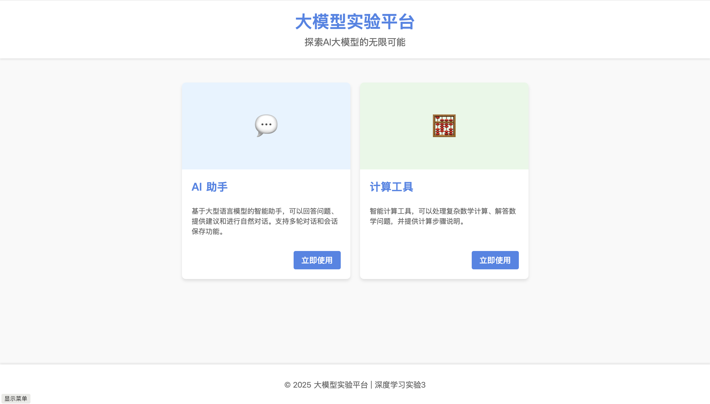
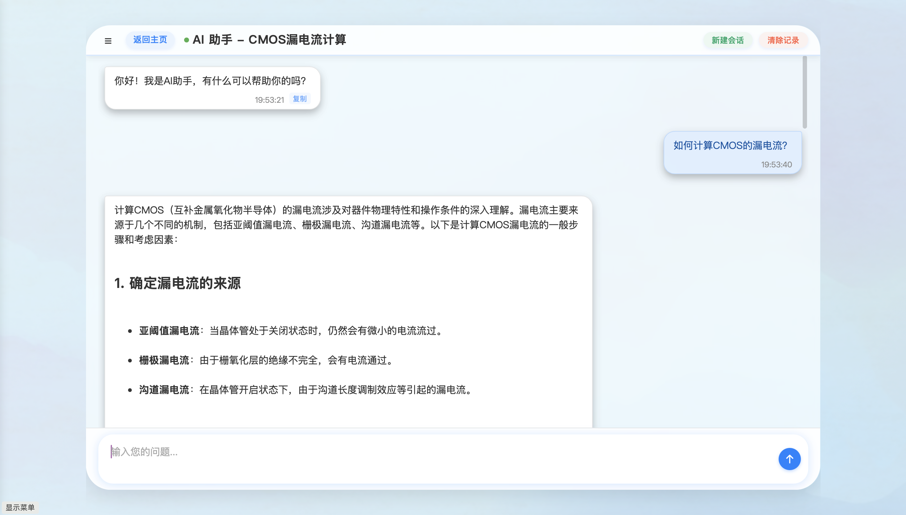
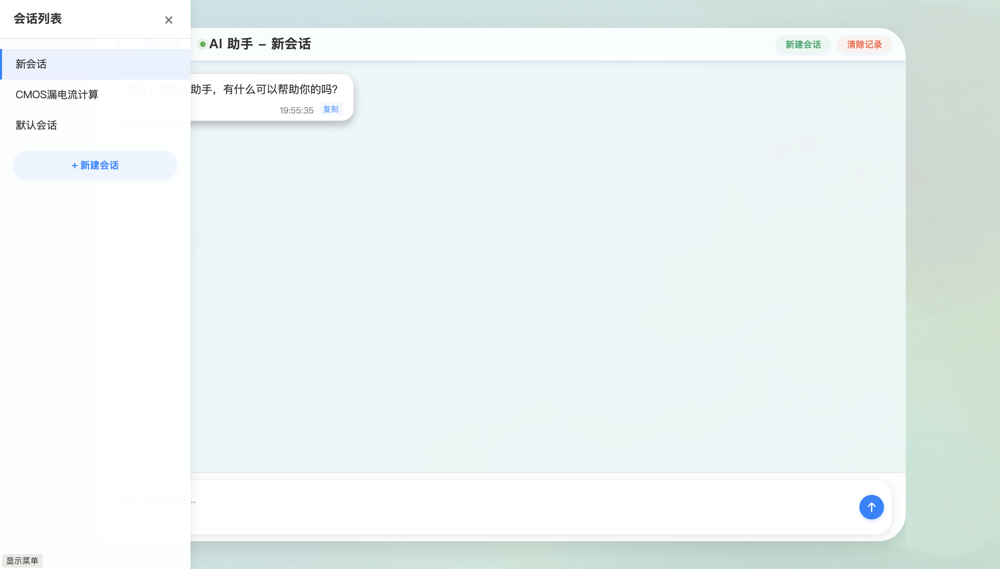

# DeepLearning-Lab3

## 项目介绍

本仓库包含深度学习课程实验3的代码，主要实现了基于大型语言模型（GLM-4）的聊天应用以及计算工具。项目包括前端界面、后端API服务以及一系列与大模型交互的实验示例。

> **重要提示**: 所有基础作业和实验内容都在 `Introduction to LLM.ipynb` 文件中完成，包括API调用、模型评测和工具增强等核心内容。


## 实验内容

本项目完成了以下几项核心实验：

1. **大模型API调用**: 基于智谱GLM-4模型API实现了对话功能
2. **能力评测与上下文学习**: 使用C-Eval测试集进行0-shot和5-shot对比评测
3. **工具增强**: 实现了计算器工具的函数调用，提升了模型处理数学计算的能力
4. **前后端开发**: 构建了完整的聊天应用，包含交互界面和后端服务

前三项实验代码和详细记录在 `Introduction to LLM.ipynb` 中。

### 创新点

1. 智能正确性评估：在模型能力评测中，考虑到原始的匹配方法是查询回复中是否包含正确答案，可能会由于模型回复了较多内容而产生假阳性的结果。我们创新性地采用了"AI评估AI"的方法。通过设计特定的系统提示词，让大模型自身来判断回答是否正确，有效解决了模型回复多样性导致的匹配困难问题。

2. 增强型数学表达式处理：计算工具不仅支持基础算术运算，还对特殊符号如`^`(幂运算)、`e`(自然对数底)等进行了智能识别和转换，使计算功能更加完善。

## 功能特点 (GUI界面)
- **AI 助手**：基于智谱GLM-4的智能对话系统，可以回答各类问题
- **计算工具**：支持复杂数学表达式计算，调用大模型的工具功能解决数学问题
- **会话管理**：支持创建、切换、重命名和删除会话
- **响应式设计**：适配不同屏幕尺寸的设备
- **Markdown渲染**：支持渲染大模型返回的Markdown文本
- **数学公式支持**：使用MathJax渲染数学公式
- **复制功能**：可以复制AI返回的原始消息内容


## 项目结构

```
DeepLearning-Lab3/
├── .env                      # 环境变量配置
├── Introduction to LLM.ipynb # 基础实验代码和详细记录
├── main.py                   # 主程序入口
├── log.md                    # 开发日志
├── gui/
│   ├── backend/              # Flask后端服务
│   │   └── server.py         # 服务器实现
│   └── front-end/            # 前端实现
│       ├── Widgets/          # UI组件
│       │   └── components/
│       │       ├── chat/     # 聊天相关组件
│       │       ├── utils/    # 工具类
│       │       └── ...
│       ├── pages/            # 页面
│       │   ├── chat.html
│       │   ├── chat.css
│       │   └── chat.js
│       ├── main.html         # 主页
│       ├── main.css
│       └── main.js
└── ceval-exam/               # C-Eval评测数据集
    ├── dev/                  # 开发集
    ├── test/                 # 测试集
    └── val/                  # 验证集
```

## 安装与运行

### 环境要求

- Python 3.8+
- 现代浏览器（Chrome、Firefox、Safari等）

### 后端设置

1. 配置API密钥：
  在项目根目录创建`.env`文件，添加智谱AI的API密钥：
  ```
  ZHIPUAPI=your_api_key_here
  ```

3. 启动后端服务：
  ```bash
  cd gui/backend
  python server.py
  ```

### 前端启动

可以使用以下任一方式启动前端：

1. **使用VS Code Live Server插件**:
   - 安装Live Server插件
   - 打开`gui/front-end/main.html`
   - 点击右下角的"Go Live"按钮，或右键选择"Open with Live Server"，或点击`cmd+L+O`(MacOS) / `Alt+L+O`(Windows)

2. **使用Python HTTP服务器**:
  ```bash
  cd gui/front-end
  python -m http.server 8080
  ```
  然后在浏览器中访问 `http://localhost:8080/main.html`


## 使用说明
1. 请保持页面缩放比例为100%以获得较好的使用体验
2. 通过主页选择使用"AI助手"或"计算工具"
3. 在对话界面输入问题进行交流
4. 使用左上角的菜单按钮可以管理不同会话
5. 点击消息右下角的"复制"按钮可以复制消息内容

## 使用示例

### 1. 主页面



主页面展示了两个主要功能模块：AI助手和计算工具。用户可以根据需求选择相应的功能入口。

### 2. 聊天界面



聊天界面是用户与AI助手交互的主要场所。如图所示，界面设计包括：
- 顶部导航栏，显示当前会话标题和操作按钮
- 中间的消息区域，清晰区分用户消息和AI回复
- 底部的输入框，用于用户输入问题
- AI回复支持富文本格式，包括Markdown语法、数学公式等

用户可以通过聊天界面向AI提问各类问题，包括专业知识、数学计算等。图中展示了一个关于CMOS漏电流计算的问题示例，AI提供了详细的专业解答。

### 3. 会话管理



会话管理功能允许用户：
- 创建新的对话会话
- 在不同会话之间切换
- 重命名或删除已有会话
- 保存会话历史记录

通过侧边栏可以看到所有创建的会话列表，点击可以切换到相应会话。这一功能使用户能够同时进行多个不同主题的对话，并方便地在它们之间切换，提高了使用效率。

## 实验要求与完成情况

本次实验的所有基本要求和进阶要求均已完成：

| 要求 | 完成情况 | 位置 |
| --- | --- | --- |
| 大模型API调用与函数封装 | ✓ | Introduction to LLM.ipynb (0x0部分) |
| 模型能力评测（0-shot与5-shot） | ✓ | Introduction to LLM.ipynb (0x1部分) |
| 工具增强实现 | ✓ | Introduction to LLM.ipynb (0x2部分) |
| 前端UI开发 | ✓ | gui/front-end/ |
| 后端服务开发 | ✓ | gui/backend/ |

## 许可证

本项目采用MIT许可证，详情见LICENSE文件。

## 作者

Yaojia Wang